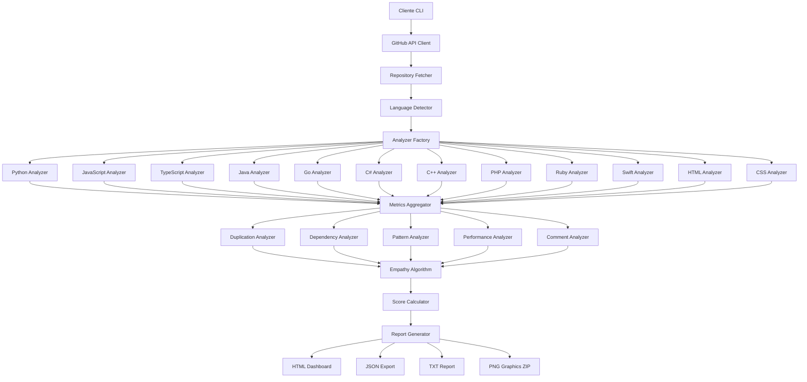
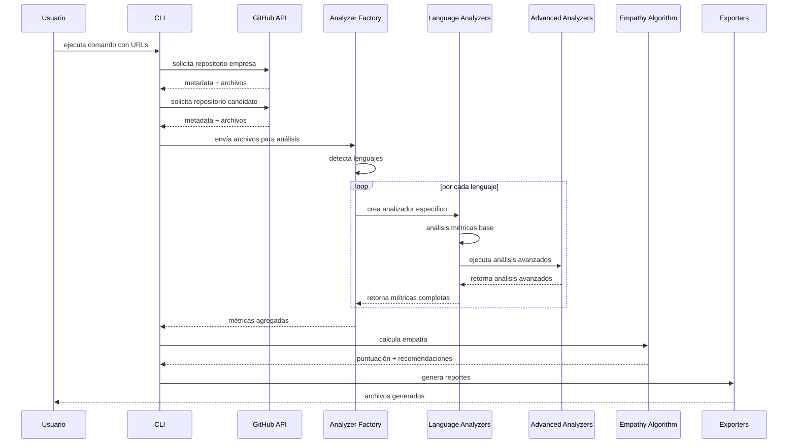

# CODE EMPATHIZER V2.2.2

> Herramienta de análisis estático para medir la alineación entre código de empresa y candidatos.

[](https://python.org)
[](https://docs.github.com/en/rest)
[](LICENSE)
[](#lenguajes-soportados)
[](https://github.com/686f6c61/Code-Empathizer/actions/workflows/test.yml)

---

## ÍNDICE

1. [DESCRIPCIÓN](#descripción)
2. [ARQUITECTURA](#arquitectura)
3. [MÉTRICAS ANALIZADAS](#métricas-analizadas)
4. [ALGORITMO DE EMPATÍA](#algoritmo-de-empatía)
5. [INSTALACIÓN](#instalación)
6. [USO](#uso)
7. [CONFIGURACIÓN](#configuración)
8. [EXPORTACIÓN](#exportación)
9. [CASOS DE USO](#casos-de-uso)
10. [CONTRIBUCIÓN](#contribución)
11. [LICENCIA](#licencia)

---

## DESCRIPCIÓN

Code Empathizer analiza repositorios de código para determinar la alineación entre el estilo de programación de una empresa y sus candidatos. Proporciona una puntuación objetiva basada en 11 categorías de análisis estático.

### CAPTURAS DE PANTALLA

#### Inicio y configuracion


#### Menu de opciones


#### Seleccion de repositorios


#### Proceso de analisis


#### Resultado de empatia


#### Dashboard HTML


### PROPÓSITO

Evaluar la compatibilidad técnica entre:
- Código maestro de la empresa
- Código de portfolio de candidatos
- Proyectos de múltiples candidatos (modo equipo)

### BENEFICIOS

- Evaluación objetiva basada en métricas cuantificables
- Reducción de tiempo en entrevistas técnicas
- Identificación de áreas de capacitación específicas
- Comparación normalizada entre candidatos
- Análisis de 12 lenguajes de programación

---

## ARQUITECTURA

### DIAGRAMA DEL SISTEMA



### FLUJO DE ANÁLISIS



### COMPONENTES PRINCIPALES

#### ANALIZADORES BASE
- **src/language_analyzers/base.py** - Clase abstracta con Template Method
- **src/language_analyzers/python_analyzer.py** - Análisis basado en AST
- **src/language_analyzers/javascript_analyzer.py** - Análisis basado en regex
- Otros 9 analizadores específicos por lenguaje

#### ANALIZADORES AVANZADOS
- **src/duplication_analyzer.py** - Detección de código duplicado
- **src/dependency_analyzer.py** - Mapeo de dependencias
- **src/pattern_analyzer.py** - Detección de patrones de diseño
- **src/performance_analyzer.py** - Análisis de rendimiento
- **src/comment_analyzer.py** - Análisis de comentarios y TODOs

#### NÚCLEO DEL SISTEMA
- **src/empathy_algorithm.py** - Algoritmo de cálculo de empatía
- **src/github_utils.py** - Cliente de GitHub API
- **src/exporters.py** - Generación de reportes
- **src/exporters_png.py** - Generación de gráficas PNG
- **src/cache_manager.py** - Sistema de caché

---

## MÉTRICAS ANALIZADAS

### MÉTRICAS BASE (8 CATEGORÍAS)

| Categoría | Peso | Descripción |
|-----------|------|-------------|
| Nombres descriptivos | 12% | Claridad de variables, funciones y clases |
| Documentación | 12% | Cobertura de docstrings y comentarios |
| Modularidad | 10% | Organización en módulos y componentes |
| Complejidad | 10% | Complejidad ciclomática y niveles de anidación |
| Manejo de errores | 8% | Cobertura de excepciones y validación |
| Pruebas | 8% | Detección de tests y aserciones |
| Seguridad | 6% | Validación de entradas y funciones peligrosas |
| Consistencia de estilo | 4% | Formato, espaciado e indentación |

### ANÁLISIS AVANZADOS (3 CATEGORÍAS)

| Categoría | Peso | Descripción |
|-----------|------|-------------|
| Patrones de diseño | 12% | Detección de patrones y anti-patrones |
| Rendimiento | 10% | Operaciones costosas y complejidad algorítmica |
| Comentarios y TODOs | 8% | Ratio código/comentarios y marcadores |

### LENGUAJES SOPORTADOS

| Lenguaje | Extensiones | Método de Análisis |
|----------|-------------|-------------------|
| Python | .py | AST (Abstract Syntax Tree) |
| JavaScript | .js, .jsx, .mjs | Regex optimizado |
| TypeScript | .ts, .tsx | Regex optimizado |
| Java | .java | Pattern matching |
| Go | .go | Regex optimizado |
| C# | .cs | Regex optimizado |
| C++ | .cpp, .cc, .cxx, .hpp, .h, .hh | Regex optimizado |
| PHP | .php, .php3, .php4, .php5, .phtml | Regex optimizado |
| Ruby | .rb, .rake, .gemspec | Regex optimizado |
| Swift | .swift | Regex optimizado |
| HTML | .html, .htm, .xhtml | Estructura DOM |
| CSS | .css, .scss, .sass, .less | Selectores y propiedades |

---

## ALGORITMO DE EMPATÍA

### FÓRMULA GENERAL

```
E = (Σ Si × Wi × Ci) × L × Π Fk
```

Donde:
- **E** = Puntuación de empatía (0-100)
- **Si** = Puntuación de categoría i
- **Wi** = Peso de categoría i
- **Ci** = Factor de correlación
- **L** = Factor de coincidencia de lenguajes
- **Fk** = Factores de ajuste

### FACTORES DE AJUSTE

#### F1: FACTOR DE COMPLEJIDAD
Penaliza diferencias extremas en complejidad del código.

#### F2: FACTOR DE CONSISTENCIA
Bonifica puntuaciones homogéneas entre categorías.

#### F3: FACTOR DE EXCELENCIA
Bonifica categorías críticas con puntuación superior al 85%.

#### F4: FACTOR DE ANTI-PATRONES
Penaliza presencia de anti-patrones (god class, spaghetti code).

#### F5: FACTOR DE PATRONES
Bonifica uso de patrones de diseño reconocidos.

#### F6: FACTOR DE BALANCE
Bonifica distribución equilibrada de puntuaciones.

### INTERPRETACIÓN DE RESULTADOS

| Rango | Nivel | Descripción |
|-------|-------|-------------|
| 90-100% | Excelente | Estilo muy alineado con la empresa |
| 75-89% | Bueno | Buena alineación con áreas menores de mejora |
| 60-74% | Aceptable | Alineación moderada, requiere adaptación |
| 45-59% | Bajo | Baja alineación, requiere capacitación significativa |
| 0-44% | Muy bajo | Estilo muy diferente, no recomendado |

---

## INSTALACIÓN

### PRERREQUISITOS

- Python 3.8 o superior
- Token de GitHub con permisos `public_repo` y `read:user`
- 500 MB de espacio libre para caché

### INSTALACIÓN AUTOMÁTICA (RECOMENDADO)

```bash
git clone https://github.com/686f6c61/Code-Empathizer.git
cd Code-Empathizer
chmod +x start.sh
./start.sh
```

El script `start.sh` realizará:
1. Creación de entorno virtual
2. Instalación de dependencias (interactivo)
3. Verificación de configuración
4. Menú de opciones disponibles

### INSTALACIÓN MANUAL

```bash
git clone https://github.com/686f6c61/Code-Empathizer.git
cd Code-Empathizer

python3 -m venv venv
source venv/bin/activate

pip install -r requirements.txt

cp .env.example .env
# Editar .env con tu token de GitHub
```

### OBTENCIÓN DEL TOKEN DE GITHUB

1. Acceder a https://github.com/settings/tokens
2. Generar token con permisos: `public_repo`, `read:user`
3. Copiar token en archivo `.env`

```bash
# .env
GITHUB_TOKEN=ghp_tu_token_aqui
```

---

## USO

### MODO INTERACTIVO

```bash
source venv/bin/activate
python3 src/main.py
```

El modo interactivo solicitará:
1. URL o formato usuario/repo de la empresa
2. URL o formato usuario/repo del candidato
3. Formatos de reporte a generar

### REPOSITORIOS PREDEFINIDOS

Para agilizar el análisis de repositorios frecuentes, puede crear un archivo `REPO.txt` en la raíz del proyecto con URLs o referencias en formato usuario/repo, una por línea:

```bash
# REPO.txt
empresa/repositorio-master
candidato1/portfolio
candidato2/proyectos
https://github.com/otro/repo
```

Al ejecutar el modo interactivo, estos repositorios aparecerán como opciones numeradas para selección rápida.

### MODO LÍNEA DE COMANDOS

#### ANÁLISIS BÁSICO
```bash
python3 src/main.py \
  --empresa "empresa/repositorio" \
  --candidato "candidato/repositorio"
```

#### CON FORMATO ESPECÍFICO
```bash
python3 src/main.py \
  --empresa "django/django" \
  --candidato "pallets/flask" \
  --output html
```

#### TODOS LOS FORMATOS
```bash
python3 src/main.py \
  --empresa "facebook/react" \
  --candidato "vuejs/core" \
  --output all
```

#### SIN CACHÉ
```bash
python3 src/main.py \
  --empresa "empresa/repo" \
  --candidato "candidato/repo" \
  --no-cache
```

### MODO EQUIPO (MÚLTIPLES CANDIDATOS)

```bash
python3 src/main.py \
  --empresa "mi-empresa/backend" \
  --candidatos "candidato1/portfolio" "candidato2/proyectos" "candidato3/codigo" \
  --team-mode \
  --output all
```

### OPCIONES DISPONIBLES

| Opción | Descripción |
|--------|-------------|
| `--empresa` | Repositorio maestro de la empresa |
| `--candidato` | Repositorio del candidato |
| `--candidatos` | Múltiples candidatos (requiere --team-mode) |
| `--team-mode` | Activa modo equipo |
| `--output` | Formato: txt, json, html, dashboard, all |
| `--no-cache` | Deshabilita uso de caché |
| `--clear-cache` | Limpia caché antes de ejecutar |
| `--languages` | Filtra lenguajes específicos |
| `--list-languages` | Lista lenguajes soportados |

---

## CONFIGURACIÓN

### VARIABLES DE ENTORNO

```bash
# .env
GITHUB_TOKEN=ghp_xxxxxxxxxxxx
CACHE_TTL=86400
PARALLEL_WORKERS=4
ANALYSIS_TIMEOUT=300
```

### CONFIGURACIÓN YAML

```yaml
# config.yaml
analysis:
  max_files_per_language: 100
  ignore_patterns:
    - "*/test/*"
    - "*/vendor/*"
    - "*/node_modules/*"

weights:
  nombres: 0.12
  documentacion: 0.12
  modularidad: 0.10
  complejidad: 0.10
  manejo_errores: 0.08
  pruebas: 0.08
  seguridad: 0.06
  consistencia_estilo: 0.04
  patrones: 0.12
  rendimiento: 0.10
  comentarios: 0.08

languages:
  importance_multiplier:
    Python: 1.2
    TypeScript: 1.1
    JavaScript: 1.0
```

---

## EXPORTACIÓN

### FORMATOS DISPONIBLES

| Formato | Extensión | Descripción |
|---------|-----------|-------------|
| TXT | .txt | Reporte de texto plano |
| JSON | .json | Datos estructurados |
| HTML | .html | Reporte HTML estático |
| Dashboard | .html | Dashboard interactivo Bootstrap 5 |
| Gráficas | .zip | PNG de alta resolución (300 DPI) |

### EJEMPLOS DE REPORTES

El directorio `examples/` contiene reportes de muestra generados con la herramienta:

```
examples/
├── reporte_20251125_124531.txt    # Reporte texto plano
├── reporte_20251125_124531.json   # Datos estructurados JSON
├── reporte_20251125_124531.html   # Dashboard HTML interactivo
└── graficas_20251125_124531.zip   # Gráficas PNG de alta resolución
```

### GRÁFICAS PNG

El archivo ZIP incluye:

1. **grafica_radar_[timestamp].png**
   - Comparación general en formato radar
   - Visualiza todas las categorías simultáneamente

2. **grafica_barras_[timestamp].png**
   - Comparación categoría por categoría
   - Barras comparativas empresa vs candidato

3. **grafica_categorias_[timestamp].png**
   - Gráfica de líneas con evolución
   - Muestra diferencias absolutas

4. **grafica_distribucion_[timestamp].png**
   - Pie charts duales
   - Distribución porcentual por categoría

5. **grafica_heatmap_[timestamp].png**
   - Mapa de calor
   - Intensidad de métricas por categoría

6. **README.txt**
   - Instrucciones de uso
   - Información técnica

#### ESPECIFICACIONES TÉCNICAS

- **Formato**: PNG sin pérdida
- **Resolución**: 300 DPI
- **Dimensiones**: 2879×2369 px promedio
- **Tamaño**: 245-519 KB por gráfica
- **Color**: RGBA, 8 bits por canal

---

## CASOS DE USO

### PROCESO DE CONTRATACIÓN

1. Pre-screening automatizado de candidatos
2. Evaluación objetiva basada en código real
3. Reducción de tiempo en entrevistas técnicas
4. Comparación normalizada entre múltiples candidatos

### ONBOARDING DE DESARROLLADORES

1. Identificación de áreas de capacitación
2. Plan personalizado de adaptación
3. Métricas de progreso en el tiempo
4. Benchmarking con estándares de la empresa

### AUDITORÍA DE CÓDIGO

1. Evaluación de consistencia en equipos
2. Identificación de desviaciones de estándares
3. Mejora de calidad general del código
4. Análisis de dependencias y acoplamiento

### EVALUACIÓN DE CONSULTORES

1. Verificación de alineación previa
2. Evaluación de capacidad de adaptación
3. Minimización de fricción en proyectos
4. Validación de experiencia técnica

---

## CONTRIBUCIÓN

### PROCESO

1. Fork del repositorio
2. Crear rama feature (`git checkout -b feature/NuevoAnalizador`)
3. Commit de cambios (`git commit -am 'Add: Analizador para Rust'`)
4. Push a la rama (`git push origin feature/NuevoAnalizador`)
5. Abrir Pull Request

### ÁREAS DE CONTRIBUCIÓN

- Nuevos analizadores de lenguajes
- Mejoras en detección de patrones
- Nuevas métricas de análisis
- Optimización de rendimiento
- Documentación técnica

### ESTÁNDARES DE CÓDIGO

- Castellano neutro en comentarios y documentación
- Encabezados en mayúsculas
- Sin emojis en código
- PEP 8 para Python
- Type hints obligatorios

---

## LICENCIA

Este proyecto está licenciado bajo la Licencia MIT.

```
Copyright (c) 2025 https://github.com/686f6c61

Se concede permiso para usar, copiar, modificar y distribuir este software
con fines comerciales y no comerciales, siempre que se incluya este aviso
de copyright en todas las copias o partes sustanciales del software.
```

Ver archivo [LICENSE](LICENSE) para más detalles.

---

## INFORMACIÓN DEL PROYECTO

- **Versión**: 2.2.2
- **Autor**: https://github.com/686f6c61
- **Repositorio**: https://github.com/686f6c61/Code-Empathizer
- **Licencia**: MIT
- **Fecha**: Noviembre 2025

---

## CONTACTO Y SOPORTE

Para reportar problemas o solicitar funcionalidades:
- **Issues**: https://github.com/686f6c61/Code-Empathizer/issues
- **Discusiones**: https://github.com/686f6c61/Code-Empathizer/discussions

---

**Desarrollado para mejorar los procesos de evaluación técnica**
